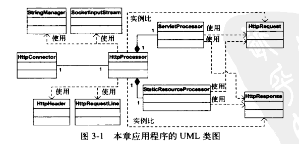
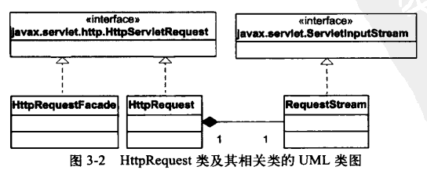
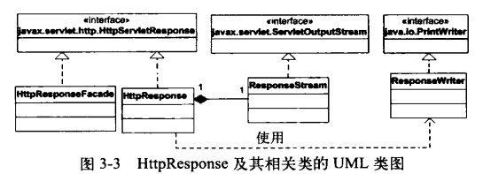

# 文档

该 Servlet 容器构建了一个连接器（connector）模块，它用一个更好的方法来创建请求和响应对象。

兼容 Servlet 2.3 和 2.4 规范的连接器必须要负责创建 `javax.servlet.http.HttpServletRequest` 和 `javax.servlet.http.HttpServletResponse` 对象，井将它们作为 Servlet 的 `service()` 的参数传入。

连接器负责解析 HTTP 请求，使 Servlet 实例能够获取到请求头、Cookie 和 请求参数等信息。有了这些增强功能后，就可以从 Servlet 中获得完整的响应信息了（例如 `ModernServlet`）。

该连接器是 Tomcat 4 中默认连接器的一个简化版。由于该连接器性能不高，已经不推荐使用。例如，所有的 HTTP 请求头都会被解析，即使并不会在 Servlet 中使用它们。因此，默认连接器运行缓慢，现在已经被 Coyote 连接器所替代。

要在 Windows 平台下运行该应用程序，需要在工作目录下执行如下命令：

```
java -classpath ./lib/servlet.jar;./com.gmail.tequlia2pop.bendog.startup.Bootstrap
```

要在 Linux 平台下运行该应用程序，需要使用冒号来代替库文件之间的分号：

```
java -classpath ./lib/servlet.jar:./com.gmail.tequlia2pop.bendog.startup.Bootstrap
```

要显示 index.html 文件，可以使用如下的 URL：

```
http://localhost:8080/index.html
```

要调用 `PrimitiveServlet` 类，可以使用如下的 URL：

```
http://localhost:8080/servlet/PrimitiveServlet
```

现在可以通过如下的 URL 调用 `ModernServlet` 类来打印出完整的响应信息：

```
http://localhost:8080/servlet/ModernServlet?userName=tarzan&password=pwd
```

## 应用程序结构

应用程序包含3个模块：连接器模块、启动模块和核心模块。

* 启动模块

	只有一个 `Bootstrap` 类，它负责启动应用程序。

* 连接器模块

	* 连接器以及支持类（`HttpConnector` 和 `HttpProcessor`）；
	* 表示 HTTP 请求的类（`HttpRequest`）及其支持类；
	* 表示 HTTP 响应的类（`HttpResponse`）及其支持类；
	* 外观类（`HttpRequestFacade` 和 `HttpResponseFacade`）；
	* 常量类。

* 核心模块

	包含两个类，`ServletProcessor` 类和 `StaticResourceProcessor` 类。

-------------------------------------------------------------------

下面是应用程序的 UML 类图。其中，与 `HttpRequest` 类和 `HttpResponse` 类相关的类被省略掉了。



* HttpConnector：HTTP 连接器。它负责创建一个服务器套接字，并等待传入的 HTTP 请求。

* HttpProcessor：HTTP 处理器。它负责创建 `HttpRequest` 和 `HttpResponse` 对象；解析 HTTP 请求的第一行内容和请求头信息，并填充到 `HttpRequest` 对象；最后将  `HttpRequest` 和 `HttpResponse` 对象传递给 `ServletProcessor` 或 `StaticResourceProcessor` 处理。

	`HttpProcessor` 类使用其 `parse()` 方法解析 HTTP 请求中的请求行和请求头信息，并将其填充到 `HttpRequest` 对象，但是并不会解析查询字符串或请求体中的参数。这个任务由各个 `HttpRequest` 对象自己完成。这样，只有当 Servlet 实例需要使用某个参数时，才会由 `HttpRequest` 对象去解析查询字符串或请求体。

* ServletProcessor：它负责载入相应的 Servlet 类，调用其 `service()` 方法，同时传入 `ServletRequest` 和 `ServletResponse` 对象。

	URI 的格式为：`servlet/servletName`，其中 `servletName` 是请求的 Servlet 资源的类名。

	注意：每次请求 Servlet 都会载入相应的 Servlet 类，并且不会调用 Servlet 的 `init()` 和 `destroy()` 方法。

* StaticResourceProcessor：静态资源处理器，委托响应对象来处理静态资源。

* StringManager：用于处理应用程序中不同包中错误消息的国际化操作。

* SocketInputStream：连接器使用 `SocketInputStream` 类从套接字的 `InputStream` 对象中读取字节流。`SocketInputStream` 实例是 `java.io.InputStream` 实例的包装类，它提供了两个重要的方法：`readRequestLine()` 读取 HTTP 请求中第1行的内容，`readHeader()` 读取所有的请求头信息。由于从套接字的输入流中处理字节流是从第一个字节读取到最后一个字节的内容（无法从后向前读取），所以 `readRequestLine()` 必须在 `readHeader()` 方法之前调用。

-------------------------------------------------------------------

下面展示了 `HttpRequest` 及其相关类的 UML 类图：



`HttpRequest` 表示HTTP 请求。该类实现了 `HttpServletRequest` 接口；虽然其中很多方法都是空方法，但是已经可以从中获取引入的 HTTP 请求的请求头、Cookie 信息和请求参数等信息了。`HttpRequestFacade` 是请求对象的外观类。

`HttpRequest` 对象会被转型为 `HttpServletRequest` 对象，然后作为参数传递给被调用的 Servlet 实例的 `service()` 方法。因此，必须正确地设置每个 `HttpRequest` 实例的成员变量供 Servlet 实例使用。需要设置的值包括：请求方法、URI、查询字符串、参数	、Cookie 和 其他一些请求头信息。因为连接器并不知道被调用的 Servlet 会使用哪些变量，所以连接器必须解析从 HTTP 请求中获取的所有信息。但是，解析 HTTP 请求涉及一些系统开销大的字符串操作以及一些其他操作。若是连接器仅仅解析会被 Servlet 实例用到的值就会节省很多 CPU 周期。

-------------------------------------------------------------------

下面展示了 `HttpResponse` 类及其相关类的 UML 类图：



`HttpResponse` 表示 HTTP 响应。它实现了 `javax.servlet.http.HttpServletResponse` 接口。`HttpResponseFacade` 是响应对象的外观类。

* 在处理静态资源时，响应对象会读取静态资源文件的内容，并直接使用底层套接字的 `OutputStream` 来进行输出。

* 在 Servlet 中，可以使用响应对象的 `PrintWriter` 对象向输出流中写字符，但在向浏览器发送字符的时候，实际上都是字节流。这里使用 `ResponseStream` 类的实例作为 `PrintWriter` 的输出流对象。`ResponseStream` 是 `java.io.OutputStream` 类的直接子类；在内部实际上也是委托响应对象使用底层套接字的 `OutputStream` 来进行输出。

	也可以使用 `ResponseWriter` 类来向客户端发送信息，该类继承自 `PrintWriter` 类，重写了所有的 `print()` 和 `println()` 方法，这样对这些方法进行调用时，会自动将信息发送给客户端。

注意，在该应用中没有实现向客户端发送响应头的功能。

## 解析 HTTP 请求

解析 HTTP 请求相对来说比较复杂，将其分成5个小节来进行说明：

* 读取套接字的输入流
* 解析请求行
* 解析请求头
* 解析 Cookie
* 获取参数

### 读取套接字的输入流
	
使用 `SocketInputStream` 来包装套接字的输入流。该类提供了一些方法来获取请求行和请求头信息。

### 解析请求行

`HttpProcessor` 类的 `parseRequest()` 方法负责解析 HTTP 请求的第1行内容，包括请求方法、请求 URI、请求协议和版本，以及查询字符串和 session ID。请求行信息由一个 `HttpRequestLine` 类表示。

关于请求 URI，有以下注意事项：

* 请求 URI 后面可以加上可选的查询字符串。当浏览器禁用 Cookie 时，也可以将会话标识（jsessionid）嵌入到查询字符串中。
* 当请求 URI 是一个绝对路径中的值时，需要删除其协议和主机名部分。
* 对请求 URI 要进行规范化。例如，出现"\"的地方会被替换为"/"。

### 解析请求头

`HttpProcessor` 类的 `parseHeader` 方法解析了一些“简单”的请求头。请求头信息由一个 `HttpHeader` 类表示。 

### 解析 Cookie

Cookie 是由浏览器作为 HTTP 请求头的一部分发送的。这样的请求头的名称是 "cookie"，其对应值是一些名/值对。下面是一个 Cookie 请求头的例子，其中包含两个 Cookie：userName 和 password。

```
Cookie: userName=budi; password=pwd
```

对 Cookie 的解析是通过 `org.apache.catalina.util.RequestUtil` 类的 `parseCookieHeader()` 方法完成的。 

### 获取参数

参数只需要解析一次即可，而且也只会解析一次。因为，在请求体中包含参数，解析参数的工作会使 `SocketInputStream` 类读完整个字节流。

因此，在调用 `javax.servlet.http.HttpServletRequest` 的 `getParameter()`、`getParameterMap()`、`getParameterNames` 或 `getParameterValues()` 方法之前，都不需要解析参数。在 `HttpRequest` 类中，这4个方法的实现都会先调用 `parseParameter()` 方法；而 `parseParameter()` 会通过检查	 `parsed` 布尔变量来获知是否已经完成对参数的解析；只有在 `parsed` 变量为 `false` 时，才会调用 `org.apache.Catalina.util.RequestUtil` 类的 `parseParameters()` 来执行解析。当解析完成时，参数会存储在一个 `HashMap` 中。

参数可以出现在查询字符串或请求体中。若用户使用 GET 方法请求 Servlet，则所有的参数都会在查询字符串中；若用户使用 POST 方法请求 Servlet，则请求体中也可能会有参数（此时，请求头 `content-length` 的值会大于 0，`content-type` 的值为 "application/x-www-form-urlencoded"）。

注意：所有参数的名/值对都存储在一个 `HashMap` 对象中。因为不允许对参数值进行修改，所以这里使用了一个特殊的 `HashMap` 类：`org.apache.catalina.util.ParameterMap`。`ParameterMap` 继承自 `java.util.HashMap`，其中有一个名为 `locked` 的布尔变量。只有当 `locked` 变量的值为 `false` 时，才可以对 `ParameterMap` 中的名/值对进行添加、更新或者删除操作。否则，会抛出 `IllegalStateException` 异常。

## StringManager

`org.apache.catalina.util.StringManager` 用于处理应用程序中不同包中错误消息的国际化操作。

将保存错误消息的 properties 属性文件划分到不同的包中。例如，`org.apache.catalina.connector` 包下的 properties 属性文件包含该包中任何类可能抛出的所有的异常消息。当服务器运行时，会产生 `StringManager` 类的多个实例，每个实例都会读取某个包下的指定的 properties 文件。

对错误消息的国际化支持，当前支持以下三种语言：

* LocalStrings.properties 英文版错误消息
* LocalStrings_es.properties 西班牙语版错误消息
* LocalStrings_ja.properties 日语版错误消息

`StringManager` 是单例类。外部只能通过调用其公共静态方法 `getManager()` 来获得其实例，并传入一个指明了包名的参数。每个 `StringManager` 实例都会以这个包名作为其键，存储在一个 Hashtable 中。

例如，要向从 `com.gmail.tequlia2pop.bendog.connector.http` 包中获得错误码 "httpConnector.alreadyInitialized" 对应的错误消息：

```java
@Test
public void testGetString() {
	StringManager manager = StringManager
			.getManager("com.gmail.tequlia2pop.bendog.connector.http");
	assertEquals("HTTP connector has already been initialized",
			manager.getString("httpConnector.alreadyInitialized"));
}
```