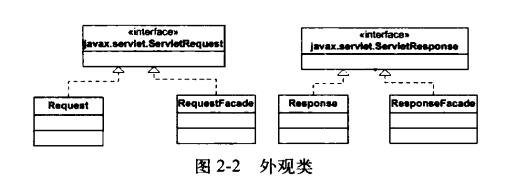

# 说明文档

该 Servlet 容器能够处理简单的 Servlet 和静态资源。`PrimitiveServlet` 可用于测试 Servlet 容器。

该 Servlet 是一个很小的容器，没有实现所有的功能。它只能运行非常简单的 Servlet，而且也不会调用 Servlet 的 `init()` 和 `destroy()` 方法。它会做以下几件事：

* 等待 HTTP 请求；
* 创建一个 ServletRequest 和 ServletResponse 对象；
* 若请求的是一个静态资源，则调用 `StaticResourceProcessor` 对象的 `process()` 方法，同时传入 ServletRequest 和 ServletResponse 对象；
* 若请求的是 Servlet，则载入相应的 Servlet 类，调用其 `service()` 方法，同时传入 ServletRequest 和 ServletResponse 对象。

当 URI 包含字符串"/servlet"时，会认为请求的是 Servlet。否则，会认为请求的都是静态资源。

注意：在该 Servlet 容器中，每次请求 Servlet 都会载入相应的 Servlet 类。

要启动服务器，请运行 `HttpServer` 类。`HttpServer` 类的实例会一直等待 HTTP 请求，直到接收到一条关闭命令。

若要请求静态资源，可以发送如下的 URL：`http://machineName:port/staticResource`。其中，`port` 表示端口号，默认为 `8080`；`staticResource` 是请求的文件的名称，它必须位于 `WEB_ROOT` 指定的目录下。例如，请求本地的 `index.html` 文件：`http://localhost:8080/index.html`。 注意：`WEB_ROOT` 在常量类 `Constants` 中定义，默认为 `src/main/webapp` 目录。

若要请求 Servlet，可以发送如下的 URL：`http://machineName:port/servlet/servletClass`。例如，请求本地名为 `PrimitiveServlet` 的 Servlet：`http://localhost:8080/servlet/PrimitiveServlet`。

若要关闭服务器，可以发送关闭命令：`http://machineName:port/shutdownCommand`。其中，`shutdownCommand` 默认为 "/SHUTDOWN"。例如，关闭本机服务器：`http://localhost:8080/SHUTDOWN`。

## 应用程序结构

## 请求/响应 Facade

在 `ServletProcessor` 的 `process()` 方法中，需要将 `Request` 和 `Response` 实例分别向上转型为 `javax.sevlet.ServletRequest` 和 `javax.servlet.ServletResponse` 实例，然后再传递给 Servlet 的 `service()` 方法。这是不安全的。开发人员可以将 `ServletRequest` 和 `ServletResponse` 实例分别向下转型为 `Request` 和 `Response` 实例，就可以调用它们各自的公共方法了。

比较完美的解决方法是为请求和响应对象分别提供一个外观类。这两个外观类分别实现了 `javax.sevlet.ServletRequest` 和 `javax.servlet.ServletResponse` 接口，并将客户的请求分别代理给对应的请求和响应对象。这样可以选择性地仅暴露 `javax.sevlet.ServletRequest` 和 `javax.servlet.ServletResponse` 接口的方法，而屏蔽了请求和响应对象中用于内部的其他接口方法。

