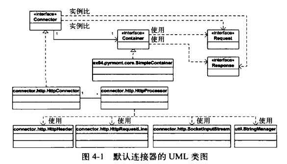
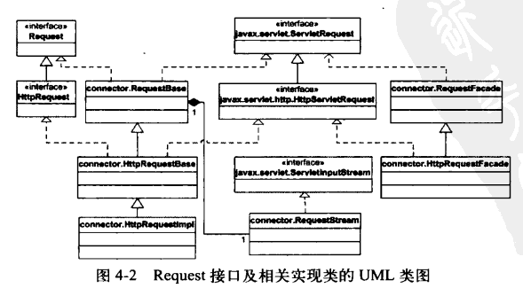
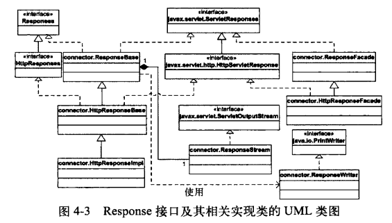

# 文档

对 Tomcat 4 中的默认连接器的精简版进行说明。该连接器已经弃用，而是推荐使用另一个称为 Coyote 的执行速度更快的连接器。但是，原先的默认连接器更简单，更容易理解。

要在 Windows 平台下运行该应用程序，需要在工作目录下执行如下命令：

```
java -classpath ./lib/servlet.jar;./com.gmail.tequlia2pop.bendog.startup.Bootstrap
```

要在 Linux 平台下运行该应用程序，需要使用冒号来代替库文件之间的分号：

```
java -classpath ./lib/servlet.jar:./com.gmail.tequlia2pop.bendog.startup.Bootstrap
```

要调用 `PrimitiveServlet` 类，可以使用如下的 URL：

```
http://localhost:8080/servlet/PrimitiveServlet
```

现在可以通过如下的 URL 调用 `ModernServlet` 类来打印出完整的响应信息：

```
http://localhost:8080/servlet/ModernServlet?userName=tarzan&password=pwd
```

注意，现在请求 index.html 文件时，无法获取到输出。因为应用程序中已经将处理静态资源的处理器移除了。

## 概述

Tomcat 中的连接器是一个独立的莫快快，可以被插入到 Servlet 容器中。有很多连接器可以使用，包括 Coyote、mod_jk、mod_jk2 和 mod_webapp 等。Tomcat 中使用连接器必须满足以下要求：

* 实现 `org.apache.catalina.Connector` 接口；
* 负责创建实现了 `org.apache.catalina.Request` 接口的 request 对象；
* 负责创建实现了 `org.apache.catalina.Response` 接口的 response 对象。

Tomcat 4 中的默认连接器与上一版的连接器类似。它会等待传入的 HTTP 请求，创建 request 对象和 response 对象，然后调用 `org.apache.catalina.Container` 接口的 `invoke()` 方法，将 request 对象和 response 对象传给 Servlet 容器。

Tomcat 4 中的默认连接器使用上一版中连接器没有的优化方法。首先，使用了一个对象池来避免了频繁创建对象带来的性能损耗。其次，在很多地方，使用了字符数组来代替字符串。

注意，Tomcat 4 中的默认连接器实现了 HTTP 1.1 的全部新特性，也可以为使用 HTTP 1.0 和 HTTP 0.9 协议的客户端提供服务。

## Connector 接口

Tomcat 的连接器必须实现 `org.apache.catalina.Connector` 接口。该接口中声明的方法中最重要的是下面几个：

* getContainer()
* setContainer()
* createRequest()
* createResponse()

下面是默认连接器的 UML 类图。注意，这里省略了 `Request` 和 `Response` 接口的实现类。除了 `SimpleContainer` 类之外，其他类胡哦接口的 `org.apache.catalina` 包名前缀也省略掉了。



连接器与 Servlet 容器是一对一的关系，箭头指向表示连接器知道要用哪个 Servlet 容器。另外，`HttpConnector` 类与 `HttpProcessor` 类是一对多的关系。

## HttpConnector 类

`HttpConnector` 类实现了 `org.apache.catalina.Connector` 接口（使其可以成为 Catalina 中的连接器）、`java.lang.Runnable` 接口（确保它的实例在自己的线程中运行）和 `org.apache.catalina.Lifecycle` 接口。`Lifecycle` 接口用于维护实现了该接口的每个 Catalina 组件的生命周期。

关于 `Lifecycle` 接口，现在只需要知道在创建一个 `HttpConnector` 实例后，应该调用其 `initialize()` 方法和 `start()` 方法；而且在组件的整个生命周期中，这两个方法只应该被调用一次。

### 创建服务器套接字

`initialize()` 会调用一个私有方法 `open()`，后者返回一个 `java.net.ServerSocket` 实例，赋值给成员变量 `serverSocket`。但是，这里的 `open()` 是从一个服务器套接字工厂得到的一个实例。

### 维护 HttpProcessor 实例

`HttpConnector` 实例维护了一个 `HttpProcessor` 实例池，每个 `HttpProcessor` 实例都运行在其自己的线程中。这样，`HttpConnector` 实例就可以同时处理多个 HTTP 请求了。同时，使用 `HttpProcessor` 实例池还避免了每次都为新请求创建 `HttpProcessor` 对象的操作。

在 `HttpConnector` 中，创建的 `HttpProcessor` 实例的个数由两个变量决定：`minProcessors` 和 `maxProcessors`。

初始，`HttpConnector` 对象会根据 `minProcessors` 的数值来创建对应数量的 `HttpProcessor` 实例。若是请求的数目超过了 `HttpProcessor` 实例所能处理的范围，`HttpConnector` 实例就会创建更多的 `HttpProcessor` 实例，直到其数量达到 `maxProcessors` 限定的范围。如果 `HttpProcessor` 实例的数目已经达到了 `maxProcessors` 限定的范围，但还是不够用。此时引入的 HTTP 请求就会被忽略掉。若希望 `HttpConnector` 可以持续地创建 `HttpProcessor` 实例，就可以将 `maxProcessors` 变量的值设置为负数。

每个 `HttpProcessor` 实例负责解析 HTTP 请求行和请求头，填充 request 对象。因此，每个 `HttpProcessor` 对象都关联一个 request 对象和一个 response 对象。`HttpProcessor` 类的构造函数会调用 `HttpConnector` 类的 `createRequest()` 和 `createResponse()` 方法。

### 提供 HTTP 请求服务

`HttpConnector` 类的主要逻辑在其 `run()` 方法中，在该方法中服务器套接字循环等待 HTTP 请求，直到 `HttpConnector` 对象关闭。

对于每个引入的 HTTP 请求，通过 `createProcessor()` 获得一个 `HttpProcessor` 对象。如果 `HttpProcessor` 栈中还有可用的实例，则直接从栈中弹出一个 `HttpProcessor` 实例。如果栈已经空了，而已经创建的 `HttpProcessor` 实例的数量还没有超过限定的最大值，则创建一个新的 `HttpProcessor` 实例；如果 `HttpProcessor` 实例的数量超过了限定的最大值，则返回 `null`。

如果 `createProcessor()` 的返回不为 `null`，则会将套接字传入 `HttpProcessor` 类的 `assign()` 方法中。否则，服务器会简单地关闭套接字，不会对这个引入的 HTTP 请求进行处理。

注意：`assign()` 直接返回，而不要等待 `HttpProcessor` 实例完成解析，这样 `HttpConnector` 才能持续服务传入的 HTTP 请求，而 `HttpProcessor` 实例是在其自己的线程中完成解析 HTTP 请求的工作的。

## HttpProcessor 类

`HttpProcessor` 类实现了 `java.lang.Runnable` 接口，这样每个 `HttpProcessor` 实例都可以运行在自己的线程中了，称为“处理器线程”。

`HttpProcessor` 类的 `run()` 会依次做如下几件事：

* 获取套接字对象；
* 处理来自此套接字的请求；
* 调用连接器的 `recycle()` 将当前的 `HttpProcessor` 实例压回栈中。

**关于 `assign()` 的异步实现**

连接器会将套接字对象分配给对应的处理器，处理器需要该套接字对象才能对 HTTP 请求进行解析。在连接器线程中，它会尝试获取套接字对象（这可能需要花费一些时间），同时创建并启动一个处理器线程（也可能复用已有的处理器线程）;也就是说，在处理器线程运行过程中，它很可能还没有从连接器线程那里获得套接字对象。要使得连接器线程和处理器线程能够正常协作，定义了一个名为 `available` 的布尔变量表示是否有新的可用套接字，然后使用 `wait()`、`notifyAll()` 来进行线程间通信。

## Request 对象

下图展示了 `Request` 接口及其实现类的 UML 类图。注意，除了 `javax.servlet` 和 `javax.servlet.http` 包下的类外，完全限定名中的 `org.apache.catalina` 省略掉了。



其中，`RequestBase` 类和 `HttpRequestBase` 类都有各自的外观类，分别是 `RequestFacade` 类和 `HttpRequestFacade` 类，而最终的实现类是 `HttpRequestImpl` 类。

## Response 对象



## 处理请求

`process()` 执行以下三个操作：解析连接、解析请求、解析请求头。在完成解析后，`process()` 将 request 和 response 对象作为参数传入 Servlet 容器的 `invoke()`。

* 解析连接  `parseConnection()` 会从套接字中获取 Internet 地址，检查是否使用了代理，最后将 Internet 地址、服务器的端口号以及 Socket 对象都赋值给 request 对象。

* 解析请求  `parseRequest()` 实际上是上一版中相似方法的全功能版本。

* 解析请求头  `parseHeader()` 使用了 `org.apache.catalina.connector.http` 包内的 `HttpHeader` 类和 `DefaultHeader` 类。`HttpHeader` 类表示一个请求头；注意，该类内部没有使用字符串，而是使用了字符数组来避免代价高昂的字符串操作。`DefaultHeaders` 类包含了字符数组形式的标准 HTTP 请求头。 

这里对 HTTP 1.1 三个新特性提供了支持：

*   **持久连接**  HTTP 1.1 引入了持久连接。使用持久连接后，页面和被页面引用的资源都会使用同一个连接来下载。考虑到建立/关闭 HTTP 连接是一个系统开销很大的操作，使用同一个连接来下载所有的资源节省很多时间和工作量。

	若协议为 HTTP 1.0，说明当前不支持持久连接，则 `parseRequest()` 会将 `keepAlive` 设置为 `false`。

*  **状态码100的使用**  如果客户端发送了较长的请求体，服务器却拒绝接收的话，会造成较大的浪费。为了解决这个问题，使用 HTTP 1.1 的客户端可以在向服务器发送较长的请求体之前，先发送一个确认请求头，并等待服务器的确认。

	* 若是在 HTTP 请求头中发现了 `Expect: 100-continue`，则 `parseHeaders()` 将设置 `sendAck` 为 `true`。

	* 若请求协议为 HTTP 1.1，而且客户端也发出了 `Expect: 100-continue` 请求头，则 `process()` 会调用 `ackRequest()` 来向客户端发送请求确认。

*  **块编码**

	`HttpRequestStream` 扩展自 `ReqeustStream`，`HttpResponseStream` 扩展自 `ResponseStream`，两者提供了对块编码的支持。

## 简单的 Container 应用程序

为了说明如何使用默认连接器，准备了以下两个类：

* `SimpleContainer` 实现了 `org.apache.catalina.Container` 接口，这样它就可以与默认连接器进行关联。

* `Bootstrap` 用于启动应用程序。

相比上一版的应用程序，这里已经移除了连接器模块，以及对 `ServletProcessor` 类和 `StaticResourceProcessor` 类的使用，所以现在不能请求静态页面了。